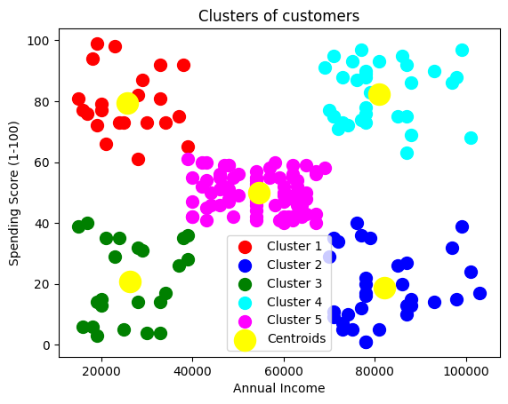
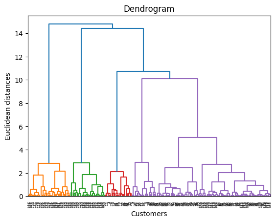

# Customer Segmentation using K-Means & Hierarchical Clustering

## Overview
This project applies **unsupervised machine learning** techniques to cluster customers based on their demographic and spending behavior.  
The goal is to identify distinct **customer segments** that businesses can target with customized marketing strategies.

---

## Dataset
**Source:** [Mall Customers Dataset on Kaggle](https://www.kaggle.com/datasets/shwetabh123/mall-customers)  
This dataset contains information about 200 mall customers.

| Feature | Description |
|----------|--------------|
| CustomerID | Unique ID assigned to each customer |
| Gender | Male/Female |
| Age | Customer's age |
| Annual Income (k$) | Annual income in thousands of dollars |
| Spending Score (1–100) | Score assigned by the mall based on customer behavior and spending nature |

---

## Project Structure

```
customer-segmentation/
│
├── data/
│   ├── raw/ 
│   └── processed/
│     
│
├── notebooks/
│   ├── 01_EDA.ipynb
|   ├── 02_Preprocessing.ipynb
│   ├── 03_KMeans_Clustering.ipynb
│   └── 04_Hierarchical_Clustering.ipynb
│
├── scripts/
│   ├── helpers.py
│   ├── preprocess.py
│   ├── train_kmeans.py
│   ├── train_hierarchical.py
│   └── predict.py
│
├── models/
│   ├── model_hc_cluster.joblib
│   └── model_kmeans_cluster.joblib
│
├── results/
│   ├── cluster_visualizations/
│   ├── predict_new_customer_cluster.csv
│   └── predict_customer_cluster.csv
│
├── README.md
├── requirements.txt
└── .gitignore
```

---

## Installation & Setup

### 1. Clone the repository
```bash
git clone <repo url>
cd customer-segmentation
```

### 2. Create a virtual environment (recommended)
```bash
python -m venv .venv
source .venv/bin/activate   # (or .venv\Scripts\activate on Windows)
```

### 3. Install dependencies
```bash
pip install -r requirements.txt
```

### 4. Download the dataset
Get the dataset from Kaggle:
- [Mall Customers Dataset](https://www.kaggle.com/datasets/shwetabh123/mall-customers)
- Place it in the folder: `data/raw/Mall_Customers.csv`

---

## Project Workflow

### Step 1 — Data Preprocessing
- Handle missing values and duplicates  
- Encode categorical features (`Gender`)  
- Scale numerical columns (`Age`, `Annual Income`, `Spending Score`)  
- Save the processed data to `data/processed/`

### Step 2 — K-Means Clustering
- Apply **Elbow Method** to determine optimal `k`  
- Train K-Means model and visualize clusters  
- Save trained model in `models/model_Kmeans_cluster.joblib`

### Step 3 — Hierarchical Clustering
- Build dendrogram to determine cluster count  
- Apply **Agglomerative Clustering**  
- Visualize resulting clusters  
- Save model in `models/model_hc_cluster.joblib`

### Step 4 — Evaluation
- Compare models using:
  - Silhouette Score

### Step 5 — Prediction
- Load saved model and predict new customer cluster.

---

## Tools & Libraries
- **Python 3.8+**
- **pandas**, **numpy**
- **scikit-learn**
- **matplotlib**, **seaborn**
- **scipy**
- **joblib**

---

## Results
Both K-Means and Hierarchical clustering successfully segmented customers into meaningful groups:

**Cluster Insights**

| Cluster | Segment Name | Avg Age | Avg Income (k$) | Avg Spending | Dominant Gender | Insights |
|----------|---------------|----------|-----------------|---------------|----------------|-----------|
| 0 | Low Income - High Spending | 25 | 26 | 79 | Female | Young, impulsive spenders with lower income. |
| 1 | High Income - Low Spending | 41 | 82 | 19 | Male | Wealthy but cautious customers with low engagement. |
| 2 | Low Income - Low Spending | 45 | 26 | 21 | Female | Older, budget-conscious group. |
| 3 | High Income - High Spending | 32 | 81 | 82 | Balanced | Premium customers high loyalty and spending. |
| 4 | Mid Income - Moderate Spending | 43 | 55 | 50 | Female | Stable, middle-class customers with balanced behavior. |

Visualizations show clear separation between clusters based on income and spending score.

---

## Visualizations



---

## Evaluation Metrics
| Model | Optimal Clusters | Silhouette Score 
|--------|------------------|------------------|
| K-Means | 5 | 0.57 |
| Hierarchical | 5 | 0.56 

---

## Key Learnings
- Performing **EDA** and **feature scaling**
- Applying **unsupervised learning** techniques
- Using **Elbow method** and **Silhouette analysis**
- Visualizing and interpreting cluster results

---

## License
This project is open-source under the **MIT License**.

